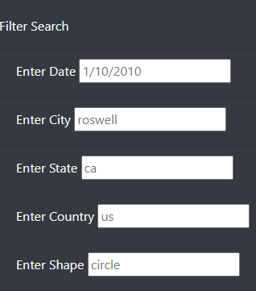
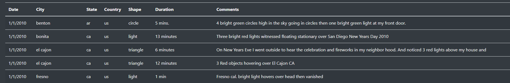
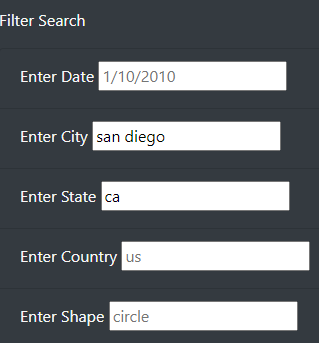
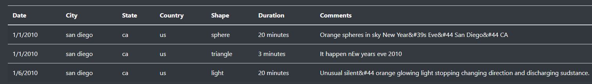

# ufo-sightings
Using JavaScript to filter data on UFO sightings

## Overview

The purpose of this project is to use JavaScript in conjunction with HTML and CSS to create a webpage that will allow the user to filter through a data file of UFO sightings. Methods such as forEach() and filter(), as well as nested functions are used to accomplish this task.  

## Results

To use this webpage, one only needs to look at the "filter search" section and enter the criteria they wish to filter the data by. Note that by default there are no filters applied, even though it gives the example of circle shaped sightings in Roswell, California on 1/10/2010. The unfilled filter section and the results shown by default are shown below:

  

Say you want to filter the data by San Diego, California. All you would have to do is go to the "Enter City" filter and type in san diego. You can also type ca into the "Enter State" filter, but since there is only one San Diego in the dataset (the one in California), it should not matter. Note that the filters are case sensitive, so all lowercase letters must be used. One you have typed in the criteria, the data displayed on the right should update to only show the three sightings that occurred in San Diego. If done correctly, your filter section and results should look like the images below:

  

## Summary

While the filter does function as intended, it still has the drawback of being case sensitive, which is not particularly user-friendly when working with proper nouns such as city, state, and country names. In order to fix this, one could use {sensitivity: base} when building the function that filters the user's input. This would allow for the input to be treated the same regardless of capitalization or accents so long as the base character is the same. For example, san diego, San Diego, and sàn diego would all be seen as the same and return the same three results. 

Furthermore, if this first change were enacted then the HTML code could be updated to remove the placeholder of roswell, ca. While the placeholder in the code's current form serves as a guide for the user on how to enter their desired filters (e.g., all lowercase letters), it would be unneeded if the filter was made case insensitive. 
